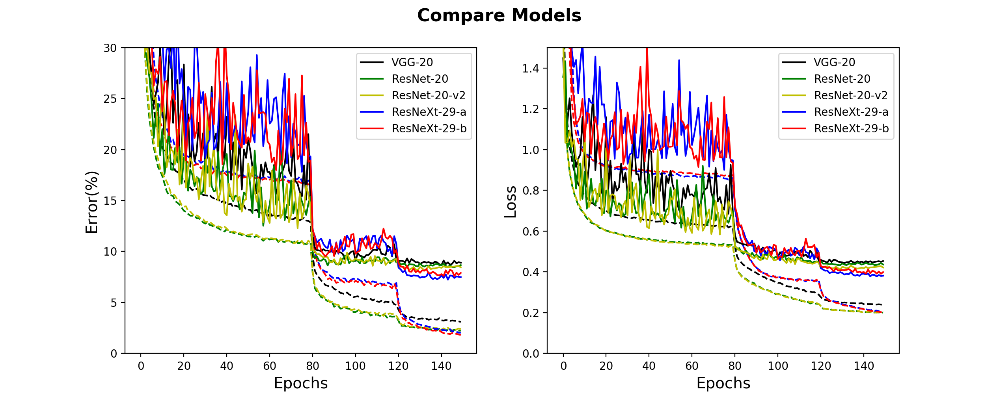

# Implement and Compare VGG, ResNet and ResNeXt on CIFAR-10

This repository implements residual convolutional networks ResNet and ResNeXt 
and its related sequential model VGG with Keras on CIFAR-10. 

### VGG
A typical VGG-like structure has two consecutive 3x3 convolution blocks on each level of
feature map size with max pooling in between.
To make it comparable to residual networks, I used global average pooling and a dense layer 
of 10 units as the head/decoder instead of three fully connected layers. Max pooling layer is 
also removed and the down sampling is done with stride-2 3x3 convolution instead (the same as ResNet).

### ResNet
There are three levels with feature map size of 32x32, 16x16, 8x8 respectively. On each level,
there are n repeats of the basic block. Each block consists of a residual path and a shortcut.
The residual path is the same as that in VGG (two consecutive 3x3 convolutions). 
For the shortcut, either (1) 1x1 convolution or (2) pooling + zero padding can be used when dimension
is not matched. I implemented the second option here to minimize the parameters.

As described above, there are 2n weighted layers on each level, as well as a first layer and a final dense layer. 
In total, there are 6n+2 weighted layers.

### ResNet v2
ResNet v2 uses full pre-activation and improves the vanilla ResNet. The idea is that batch normalization
and relu activation only happens on the residual path and thus provides better identity mapping
in the shortcut. The overall architecture is very similar to the vanilla ResNet. 

One thing to note is that the total number of parameters are the same for VGG (as modified here), 
ResNet and ResNet v2 when n (# blocks per level) is the same. 

### ResNeXt
In larger ResNet network (like ResNet-50 for ImageNet), direct 3x3 convolution is replaced by a bottleneck 1x1 
+3x3 on a smaller scale + 1x1 convolution that restores dimension. The computation volume is greatly reduced which makes it
more practical to build deeper network. On each level, there are 3n weighted layers instead of 2n and together there is
9n+2 weighted layers.

ResNeXt first adopts this bottleneck design and makes it even better. Instead of a single residual path, ResNeXt aggregates
the residual transformations. In other words, the residual path splits the channels into C slices (the number is called cardinality). 
Each slice has d channels (bottleneck width). Individual slice then performs convolutional transformations independently. 
Finally these small slices are concatenated (aggregated) again which is followed by 1x1 convolution to restore dimension.

The original paper reports a huge network of ResNeXt-29 for CIFAR-10, which has C=16, d=64, total params of 68.1M; or C=8, d=64, total params of 34.4M.
(Table 7). This requires a lot of computation resources. Here, I implemented a mini-version of ResNeXt-29 where C=8, d=4, total params of 0.37M. Note that: another
difference is that in the original paper, output dimension is increased by 4 fold on each level. Here, I reduced the increase to 2 fold. In other words,
the base total width of residual path is 32 on level 1, which becomes 64 on level 2 and 128 on level 3. In this way, the number of total parameters is
somewhat similar to that of ResNet for a fair comparison.

### Training
I trained VGG-20, ResNet-20, ResNet-20-v2 and ResNeXt-29 from scratch on CIFAR-10 (i.e. n = 3). He-normal is used as weight initialization.
In the residual network, the shortcut path may use zero-padding (option a) 1x1 convolution (option b) when the dimensions mismatch. 
To compare the effects of the two options, I implemented two variants, namely ResNeXt-29-a and ResNeXt-29-b.

CIFAR-10 data is normalized (using training set mean and std) and then augmented by Keras ImageDataGenerator.
Stochastic Gradient Descent (SGD) with Nesterov momentum of 0.9 is used as the optimizer in all the implementations here. The initial learning
rate is 0.1 and scheduled to drop to 0.01 on epoch 80 and 0.001 on epoch 120 (similar to the original paper). Total epochs is 150 and mini-batch size is 128. L2 regularization
with weight decay of 1e-4 (5e-4 for ResNeXt) is also applied to weighted layers to reduce overfitting.

### Results
ResNet-20 and ResNet-20-v2 have higher accuracy than the plain network VGG-20. ResNeXt-29 makes larger improvement at the expense of
much longer training time. When in and out dimensions of shortcut in ResNeXt-20 mismatch, zero-padding (option a) performs better than 1x1 convolution.

| Model          | Val Error (%) | Total Params (M) | Time (s) / epoch |
|----------------|:-------------:|:----------------:|:----------------:|
| VGG-20         | 8.66          | 0.27             | 38               |
| ResNet-20      | 8.45          | 0.27             | 41               |
| ResNet-20-v2   | 8.15          | 0.27             | 41               |
| ResNeXt-29-a   | 7.23          | 0.32             | 115              |
| ResNeXt-29-b   | 7.59          | 0.37             | 122              |

Training time is based on Google Colab single GPU.

Training results:

Dashed lines: training | solid lines: validation

### Reference
[1] ResNet:     <arXiv:1512.03385>

[2] VGG:        <arXiv:1409.1556>

[3] ResNet v2:  <arXiv:1603.05027>

[4] ResNeXt:    <arXiv:1611.05431>